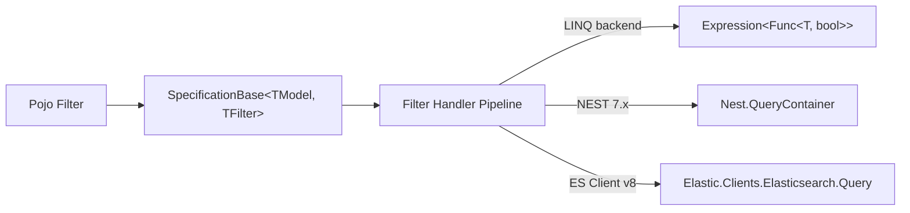

# Specifications

A *specification* is a single class that owns the rules for translating a *filter* (a plain DTO)
into a query against a *model* (an entity or an Elasticsearch document).



The base class `XSpecification.Core.SpecificationBase<TModel, TFilter, TResult>` does the heavy
lifting: it walks every public property on `TFilter` and dispatches it to a backend-specific handler
pipeline. Each backend exposes a stronger-typed wrapper:

- `XSpecification.Linq.SpecificationBase<TModel, TFilter>`
- `XSpecification.Elasticsearch.SpecificationBase<TModel, TFilter>` (NEST 7.x)

## Conventions

- Filter property names matching a model property are auto-handled by the registered handlers.
- For unmapped names (e.g. virtual filters, multi-property OR groups) use `HandleField` /
  `IgnoreField` / `OrGroup` / `AndGroup` in the constructor.
- Unhandled filter properties throw `InvalidOperationException` on first use.

## Composing specifications

Two specifications that share `TModel` and `TFilter` can be composed:

```csharp
var predicate = customerSpec.And(loyaltySpec, filter);
```

The extension methods live in
`XSpecification.Linq.SpecificationCompositionExtensions` and
`XSpecification.Elasticsearch.SpecificationCompositionExtensions`.

## Validating at startup

Call `serviceProvider.ValidateSpecifications()` after `BuildServiceProvider()` to make sure every
registered specification builds successfully against a default filter. Failures aggregate into a
single `AggregateException` so you can see all problems at once.
